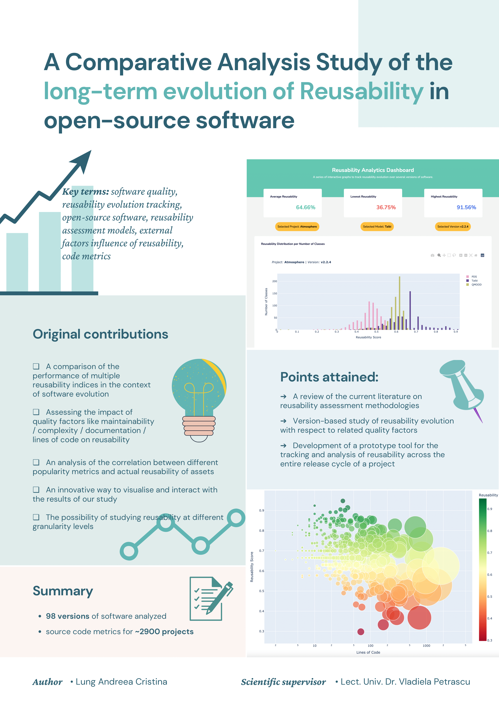
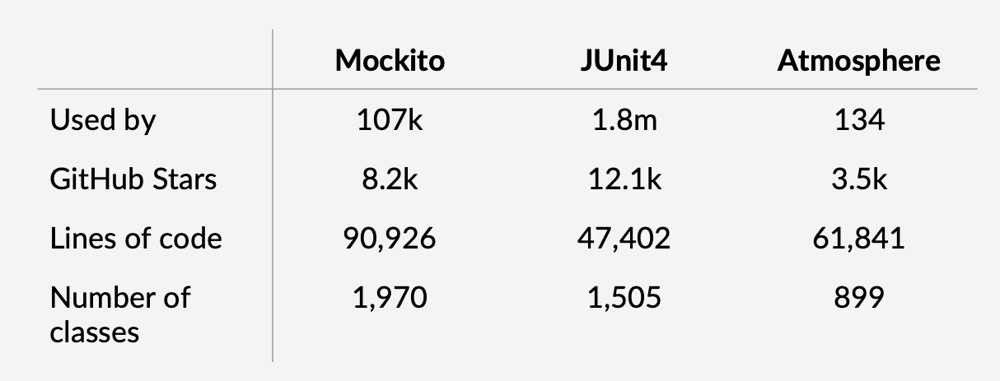
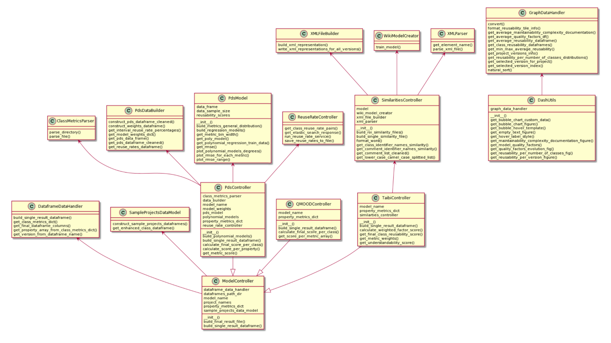

# reusability-index-analyzer
A series of interactive graphs to track reusability evolution over several versions of software.

Made with the help of [Dash](https://dash.plotly.com/).

## Context

This was done in the context of the work: 
_**"A Comparative Analysis Study of the long-term evolution of Reusability in open-source software"**_,
a study on the evolution of software reusability in relation to different quality factors. 

The written paper can be found [here.](https://drive.google.com/file/d/1DWoPX2LCd3k_-NhiQcP8eJSbvPeaGlTt/view?usp=sharing)

The main idea of the study is to:
- Implement 3 reusability models from the literature 
- Apply them on a set of open-source projects
- Track changes in reusability and the factors that influence them

## Summary



## Reusability models analyzed
- **PDS** - M. Papamichail, T. Diamantopoulos, A. Symeonidis  - [2019](https://issel.ee.auth.gr/wp-content/uploads/2019/09/2019mpapamicJSS.pdf) 
- **Taibi** - Fathi Taibi - [2014](https://citeseerx.ist.psu.edu/viewdoc/download?doi=10.1.1.851.2567&rep=rep1&type=pdf)
- **QMOOD** - J. Bansiya, C.G. Davis - [2002](https://ieeexplore.ieee.org/document/979986)

## Case-study projects

The implemented models were applied on the following 3 open-source projects:



## Case study performed on:
- **45 versions** of Mockito
- **23 versions** of JUnit4
- **30 versions** of Atmosphere

## Technologies used:

- `SourceMeter` - code metrics 
- `Plotly` - charting library
- `Dash` - UI framework
- `Gensim` - NLP topic modelling library
- `srcML` - source code to XML parser

## System architecture

##### Class Diagram


## Project structure

```
.
├── README.md
├── assets
│   └── style.css
├── dash_utils.py
├── img.png
├── main.py
├── resources
│   ├── PDS
│   │   ├── bin_reusability_scores.pkl
│   │   ├── pds_aggregate_result.csv
│   │   ├── pds_benchmark_metrics_files
│   │   ├── pds_dataframe.pkl
│   │   ├── pds_dataframe_cleaned.pkl
│   │   ├── pds_model_weights.pkl
│   │   ├── pds_regression_models
│   │   ├── pds_reuse_rates.pkl
│   │   └── polynomial_degrees.csv
│   ├── Taibi
│   │   ├── similarity_files
│   │   ├── wiki2017.model
│   │   └── wiki2017.model.vectors.npy
│   ├── final_reusability_estimation_results
│   │   ├── PDS
│   │   ├── QMOOD
│   │   └── Taibi
│   ├── images
│   │   ├── Poster_LA_Reusability_Evolution-1.png
│   │   ├── case-study.png
│   │   └── class_diagram.png
│   └── sample_projects_metrics
│       ├── csv_files
│       └── metrics_dataframes
├── src
│   ├── model_controller.py
│   ├── pds
│   │   ├── pds_controller.py
│   │   ├── pds_model.py
│   │   └── reuse_rate_controller.py
│   ├── qmood
│   │   └── qmood_controller.py
│   └── taibi
│       ├── similarities_controller.py
│       └── taibi_controller.py
└── utils
    ├── global_vars_fns.py
    ├── graph_data_utils.py
    ├── pds_utils
    │   ├── class_metrics_parser.py
    │   ├── data_utils.py
    │   └── pds_vars.py
    ├── qmood_utils
    │   └── qmood_vars.py
    ├── sample_projects_utils.py
    └── taibi_utils
        ├── taibi_util_fns.py
        ├── taibi_vars.py
        ├── wiki_model_creator.py
        ├── xml_file_builder.py
        └── xml_parser.py
```

## Launch app

- To run app, run the Python script `main.py` in the root folder:

#### `python main.py`
